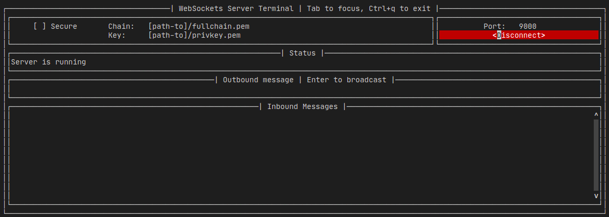

# websockets-server-terminal

A WebSockets interactive server



## Requirements

- Python 3.8.5
- prompt_toolkit 3.0.14 
- websockets 8.1

## Usage

```
python3 ws_terminal.py
```

- Press **Ctrl+q** to exit.
- Press **tab** and **shift-tab** to change focus.
- Press **Enter** to connect/disconnect and broadcast messages, depending on which field has focus.
- You might need to run with `sudo` if you want to use ssl.
